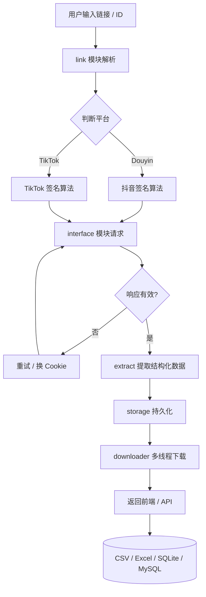

<h1>TikTokDownloader</h1>

<p>
  面向开发者的抖音 / TikTok 多维度数据采集工具<br>
  提供 Web UI · Web API · 终端交互 三种使用方式
</p>

---

## 关于本项目

**TikTokDownloader** 是一份完整的工程说明文档，而不只是一份安装手册。本文从数据输入、平台协议、签名算法、异步下载到数据持久化与对外接口，逐层解析采集台的实现原理、配置入口与维护方式。

仓库聚焦以下四类问题：

- 数据批量下载：抖音 / TikTok 视频、图集、实况、封面、音乐一键保存
- 结构化建模：账号画像、合集归档、评论情感、热门榜单的字段级采集
- 自动化集成：标准 RESTful API，可对接爬虫平台、BI 看板、数据仓库
- 零门槛使用：浏览器可视化界面，无需记忆命令行参数

---

## 在线入口

| 入口 | 地址 |
|------|------|
| GitHub 仓库 | https://github.com/xuanz54/TikTokDownloader |
| Web UI（默认） | http://127.0.0.1:8080 |
| Web API 文档 | http://127.0.0.1:5555/docs |
| Swagger JSON | http://127.0.0.1:5555/openapi.json |

---

## 技术栈

| 层级 | 技术 | 项目作用 |
|------|------|----------|
| 语言 | Python 3.12+ | 主开发语言，使用了 PEP 695 类型参数语法 |
| Web 框架 | FastAPI 0.141+ | 提供异步 Web API 与 Swagger UI |
| ASGI | Uvicorn | 高性能异步 HTTP 服务器 |
| HTTP 客户端 | httpx[socks] | 异步请求，支持 SOCKS5 代理，访问 TikTok |
| 数据模型 | Pydantic | 请求/响应参数校验与类型提示 |
| 前端渲染 | 原生 HTML + CSS + JS | Web UI 单页应用，无框架依赖 |
| 加密算法 | gmssl / never-jscore | 国密 SM4 与 JS 运行时，生成抖音 aBogus / xBogus |
| 终端美化 | rich | 终端交互模式的彩色表格与进度条 |
| 文件 IO | aiofiles / openpyxl | 异步文件读写与 Excel 表格生成 |
| 持久化 | aiosqlite / SQLite / MySQL | 异步数据库驱动，支持多种存储格式 |
| 解析 | lxml | 分享文本、HTML 二次解析 |

---

## 整体工作原理



**关键链路说明：**

1. **链接解析**：识别输入是抖音 / TikTok / 短链，提取 `aweme_id` / `sec_uid` / `mix_id` 等核心 ID
2. **签名生成**：调用自研签名算法（aBogus / xBogus / msToken / ttwid）构造合法请求头
3. **协议请求**：通过 httpx 异步发起请求，支持代理与失败重试
4. **数据提取**：将原始 JSON 响应转换为统一的结构化模型
6. **文件下载**：视频 / 图集 / 实况 / 封面 / 音乐可选并发下载
5. **持久化导出**：根据配置写入 CSV / Excel / SQLite / MySQL / JSON / TXT

---

## 目录结构

```
TikTokDownloader/
├── main.py                       # 项目主入口（终端模式 / API 模式选择）
├── web_server.py                 # Web UI 独立服务器（端口 8080）
├── start_webui.bat               # Windows 一键启动脚本
├── setup.py                      # 打包配置
├── pyproject.toml                # 项目元信息 + 依赖声明
├── requirements.txt              # 依赖锁定列表
├── uv.lock                       # uv 包管理器锁定文件
├── locale/                       # 国际化文案（zh_CN / en_US）
│   ├── en_US/
│   │   ├── LC_MESSAGES/{tk.mo,tk.po}
│   │   └── *.py
│   ├── zh_CN/
│   │   ├── LC_MESSAGES/{tk.mo,tk.po}
│   │   └── *.py
│   └── tk.pot                    # gettext 翻译模板
├── static/                       # Web UI 前端资源
│   ├── index.html                 # 单页应用入口
│   ├── style.css                 # 样式表
│   ├── app.js                    # 主交互脚本
│   ├── js/                       # 浏览器端加密算法（aBogus / xBogus）
│   └── images/                   # 静态图片资源
└── src/                          # 后端核心源码
    ├── application/              # 应用入口层
    │   ├── TikTokDownloader.py   # 主类，串联各模块
    │   ├── main_terminal.py      # 终端交互模式
    │   ├── main_server.py        # Web API 服务
    │   └── main_monitor.py       # 后台监听任务
    ├── interface/                # 各平台数据接口（21 个模块）
    │   ├── detail.py / detail_tiktok.py      # 单个作品
    │   ├── account.py / account_tiktok.py    # 账号作品
    │   ├── mix.py / mix_tiktok.py            # 合集作品
    │   ├── comment.py / comment_tiktok.py    # 作品评论
    │   ├── user.py / info.py                 # 账号资料
    │   ├── live.py / live_tiktok.py          # 直播数据
    │   ├── search.py                         # 综合搜索
    │   ├── hot.py                            # 抖音热榜
    │   ├── collection.py / collects.py       # 收藏 / 收藏夹
    │   ├── hashtag.py                        # 话题作品
    │   └── slides.py                         # 图集
    ├── encrypt/                  # 签名加密算法（X-Bogus / aBogus / msToken）
    ├── downloader/               # 文件下载器（断点续传 / 分片 / 异步）
    ├── link/                     # 分享文本 / URL 解析
    ├── extract/                  # 原始响应数据 → 结构化数据
    ├── storage/                  # 数据持久化（CSV / Excel / SQLite / MySQL）
    ├── manager/                  # 数据库 / 缓存管理
    ├── models/                   # Pydantic 数据模型
    ├── custom/                   # 自定义配置（颜色 / 端口 / 签名表）
    ├── translate/                # 多语言翻译模块
    └── tools/                    # 通用工具函数
```

---

## 内容系统实现

本节说明采集台对外暴露的能力维度。

### 数据接口维度

| 模块 | 文件 | 功能 |
|------|------|------|
| 单个作品 | `interface/detail.py` | 输入 19 位作品 ID 或完整链接 |
| 账号作品 | `interface/account.py` | `sec_uid` 拉取账号全部作品，含 `post` 与 `like` |
| 合集作品 | `interface/mix.py` | `mix_id` 拉取合集全部作品 |
| 作品评论 | `interface/comment.py` | 全部评论 + 楼中楼回复 |
| 直播数据 | `interface/live.py` | `web_rid` 解析直播推流地址 |
| 综合搜索 | `interface/search.py` | 四类搜索：general / video / user / live |
| 抖音热榜 | `interface/hot.py` | 全网热点榜单 |
| 账号资料 | `interface/user.py` | 分享文本提取账号画像 |
| 当前账号 | `interface/info.py` | 当前登录用户信息 |
| 收藏作品 | `interface/collection.py` | 个人收藏列表 |
| 收藏夹 | `interface/collects.py` | 收藏夹内作品批量采集 |
| 话题作品 | `interface/hashtag.py` | 话题 / 挑战下作品 |
| 图集作品 | `interface/slides.py` | 多图作品单独处理 |

### TikTok 对应模块

TikTok 接口实现以 `_tiktok.py` 后缀命名，文件位置与抖音接口同级：

| 模块 | 文件 | 功能 |
|------|------|------|
| TikTok 单个作品 | `interface/detail_tiktok.py` | TikTok 单个作品数据 |
| TikTok 账号作品 | `interface/account_tiktok.py` | TikTok 账号发布 / 喜欢作品 |
| TikTok 合辑 | `interface/mix_tiktok.py` | TikTok 合辑作品 |
| TikTok 评论 | `interface/comment_tiktok.py` | TikTok 作品评论 |
| TikTok 直播 | `interface/live_tiktok.py` | TikTok 直播拉流地址 |
| TikTok 账号信息 | `interface/info_tiktok.py` | TikTok 当前登录用户信息 |

### 数据字段约定

下表展示单个作品接口（`detail`）的核心字段，作为其他接口的字段参考。

| 字段 | 类型 | 说明 |
|------|------|------|
| `aweme_id` | str | 作品唯一 ID |
| `desc` | str | 作品文案 |
| `create_time` | int | 发布时间戳 |
| `nickname` | str | 作者昵称 |
| `sec_uid` | str | 作者 sec_uid |
| `digg_count` | int | 点赞数 |
| `comment_count` | int | 评论数 |
| `share_count` | int | 分享数 |
| `collect_count` | int | 收藏数 |
| `video_url` | str | 无水印视频地址 |
| `cover_url` | str | 封面图地址 |
| `music_url` | str | 背景音乐地址 |
| `image_urls` | list | 图集图片列表 |
| `live_photo_url` | str | 实况照片视频 |

---

## 主题与页面结构实现

本节说明 Web UI 的前端结构与可配置项。

### Web UI 入口

| 项 | 值 |
|----|----|
| 默认地址 | `http://127.0.0.1:8080` |
| 启动文件 | `web_server.py` |
| 静态资源目录 | `static/` |
| 启动命令 | `python web_server.py` |

### 功能面板

| 面板 | 用途 |
|------|------|
| 作品采集 | 粘贴链接 / ID → 获取数据 → 选择下载 |
| 账号作品 | 输入账号主页 → 批量采集该账号作品 |
| 合集作品 | 输入合集链接 → 批量采集合集全部作品 |
| 作品评论 | 输入作品 ID → 采集评论 + 回复 |
| 账号详情 | 输入账号主页 → 获取资料数据 |
| 直播数据 | 输入直播链接 → 获取拉流地址 |
| 抖音热榜 | 一键获取全网热点 |
| 搜索 | 综合 / 视频 / 用户 / 直播 四种搜索 |
| 设置 | 配置 Cookie / 代理 / 下载目录 |

### 状态栏

页面顶部固定显示：

- Cookie 就绪状态（抖音 / TikTok 各自独立）
- 保存目录与空间已用位置
- API 服务连通性指示
- 当前用户登录账号（已配置时显示）

---

## 交互功能实现

本节列举 Web UI 已启用与未启用项的对应开关位置。

| 功能 | 实现位置 | 启用状态 |
|------|----------|----------|
| 顶部状态栏 | `static/index.html` | 启用 |
| 多 Tab 切换 | `static/app.js` | 启用 |
| 请求日志输出 | `static/app.js` | 启用 |
| 文件下载触发 | `static/app.js` | 启用 |
| 深色模式 | 当前未提供 | 未启用 |
| 客户端 aBogus | `static/js/` | 启用 |
| 分页参数展示 | `static/app.js` | 启用 |
| Cookie 自动刷新 | `src/manager/` | 启用 |

---

## 对外 API 接口

本节说明 `main_server.py` 暴露的 RESTful 接口。所有接口均在 `/docs` 提供 Swagger UI 文档。

### 路由分类

| 路径前缀 | 用途 |
|----------|------|
| `POST /douyin/*` | 抖音数据接口（17 个端点） |
| `POST /tiktok/*` | TikTok 数据接口（6 个端点） |
| `GET/POST /settings` | 配置读写 |
| `GET /token` | Token 验证测试 |

### 接口示例

**单个作品数据：**

```bash
curl -X POST http://127.0.0.1:5555/douyin/detail \
  -H "Content-Type: application/json" \
  -H "Token: 1" \
  -d '{
    "url": "https://www.douyin.com/video/7234567890123456789",
    "cookie": "ttwid=xxx; odin_tt=xxx; msToken=xxx; sessionid=xxx",
    "proxy": ""
  }'
```

**响应：**

```json
{
  "success": true,
  "message": "ok",
  "count": 1,
  "data": [
    {
      "aweme_id": "7234567890123456789",
      "desc": "示例作品文案",
      "nickname": "示例作者",
      "create_time": 1704067200,
      "digg_count": 12345,
      "comment_count": 678,
      "collect_count": 90,
      "share_count": 12,
      "video_url": "https://...",
      "cover_url": "https://...",
      "music_url": "https://..."
    }
  ]
}
```

**账号作品批量采集：**

```bash
curl -X POST http://127.0.0.1:5555/douyin/account \
  -H "Content-Type: application/json" \
  -H "Token: 1" \
  -d '{
    "url": "https://www.douyin.com/user/MS4wLjABAAAA...",
    "cookie": "ttwid=xxx; ...",
    "pages": 5,
    "post": true,
    "like": false
  }'
```

---

## 配置分层

配置项分布在三层文件中，各自职责互不重叠。

| 配置文件 | 负责内容 |
|----------|----------|
| `src/custom/static.py` | 项目级常量（端口、并发数、日志级别） |
| `src/custom/function.py` | 业务函数（鉴权、签名生成） |
| `Volume/settings.json` | 运行时配置（Cookie、代理、保存路径） |

### 项目级常量（`src/custom/static.py`）

```python
MAX_WORKERS = 4              # 同时下载的最大任务数
SERVER_HOST = "0.0.0.0"      # API 服务器监听地址
SERVER_PORT = 5555           # API 服务器监听端口
WEBUI_PORT = 8080            # Web UI 监听端口
COOKIE_UPDATE_INTERVAL = 900 # Cookie 自动更新间隔（秒）
```

### 运行时配置（`Volume/settings.json`）

| 字段 | 类型 | 说明 |
|------|------|------|
| `cookie` | str | 抖音 Cookie |
| `cookie_tiktok` | str | TikTok Cookie |
| `proxy` | str | 抖音代理（如 `http://127.0.0.1:7890`） |
| `proxy_tiktok` | str | TikTok 代理（如 `socks5://127.0.0.1:1080`） |
| `download` | bool | 是否下载作品文件 |
| `folder_name` | str | 保存目录名 |
| `name_format` | list | 文件名模板（如 `["nickname", "desc", "create_time"]`） |
| `storage_format` | str | 数据持久化格式（`csv` / `xlsx` / `sqlite` / `mysql` / `json` / `txt`） |
| `music` | bool | 是否下载背景音乐 |
| `dynamic_cover` | bool | 是否下载动态封面 |
| `static_cover` | bool | 是否下载静态封面 |
| `max_size` | int | 单个文件最大体积（MB），0 表示不限制 |
| `chunk` | int | 分片下载大小（字节） |
| `max_retry` | int | 失败重试次数 |

---

## 本地运行

### 环境要求

| 项 | 要求 |
|----|------|
| 操作系统 | Windows 10+ / macOS 12+ / Linux (Ubuntu 20.04+) |
| Python | ≥ 3.12 |
| 内存 | ≥ 512 MB |
| 网络 | 可访问 `douyin.com` 与 `tiktok.com` |
| ffmpeg | 可选，仅在录制直播流时需要 |

### 安装

```bash
# 克隆仓库
git clone https://github.com/xuanz54/TikTokDownloader.git
cd TikTokDownloader

# 创建虚拟环境（强烈建议）
python -m venv venv
# Windows
venv\Scripts\activate
# macOS / Linux
source venv/bin/activate

# 安装依赖
pip install -r requirements.txt
# 或
uv pip install -r requirements.txt
# 或
poetry install
```

### 启动

| 模式 | 命令 | 入口 |
|------|------|------|
| Web UI | `python web_server.py` | http://127.0.0.1:8080 |
| Web API | `python main.py` 选择 `Web API 接口模式` | http://127.0.0.1:5555/docs |
| 终端交互 | `python main.py` 选择 `终端交互模式` | 终端菜单 |

Windows 用户可双击 `start_webui.bat` 一键启动 Web UI。

### 部署

| 场景 | 操作 |
|------|------|
| 内网部署 | 直接运行 `python web_server.py` 即可 |
| 公网部署 | 修改 `src/custom/function.py` 中的 `is_valid_token()` 开启鉴权 |
| Docker 化 | 参考下方最小 Dockerfile |

最小 Dockerfile 示例：

```dockerfile
FROM python:3.12-slim

WORKDIR /app
COPY requirements.txt .
RUN pip install --no-cache-dir -r requirements.txt

COPY . .

EXPOSE 5555 8080
CMD ["python", "main.py"]
```

---

## 获取抖音 Cookie（关键步骤）

> 大多数数据接口需要登录态 Cookie 才能正常访问。未配置 Cookie 时，仅热搜、公开搜索等接口可用。

### 步骤 1：浏览器登录

打开 https://www.douyin.com/ ，使用抖音 App 扫码或手机号 + 验证码登录。

### 步骤 2：打开开发者工具

| 操作系统 | 快捷键 |
|----------|--------|
| Windows / Linux | `F12` 或 `Ctrl + Shift + I` |
| macOS | `Option + Command + I` |

切换到 `Network`（网络）面板，勾选 `Preserve log`（保留日志）。

### 步骤 3：触发请求

刷新首页或点击任意视频，确保列表中出现至少一条 `douyin.com` 请求。

### 步骤 4：复制 Cookie

1. 在网络请求列表中点击任意一条 `douyin.com` 请求
2. 右侧切换到 `Headers` 标签页
3. 向下滚动找到 `Request Headers` → `cookie:` 字段
4. 全选并复制 `cookie:` 后面那串很长的文本

示例：

```
ttwid=xxx%7Cxxx; odin_tt=xxx; msToken=xxx; sessionid=xxx; ...
```

完整 Cookie 长度通常在 200 ~ 600 字符之间，包含 `ttwid`、`odin_tt`、`msToken`、`sessionid` 等关键字段。

### 步骤 5：填入配置

| 启动方式 | 操作 |
|----------|------|
| Web UI | 打开「设置」面板 → 粘贴到「抖音 Cookie」输入框 → 点击「保存」 |
| 终端模式 | 首次启动时自动生成 `Volume/settings.json`，将 Cookie 粘贴到 `cookie` 字段 |
| API 模式 | 在请求参数中传入 `cookie` 字段（无需重启） |

TikTok Cookie 获取方法完全一致，访问 https://www.tiktok.com/ 并捕获 `tiktok.com` 请求的 Cookie，填入 `cookie_tiktok` 字段。

---

## 常见问题

| 现象 | 原因 | 处理方式 |
|------|------|----------|
| 启动报错 `ModuleNotFoundError` | 未激活虚拟环境或未安装依赖 | 重新执行 `pip install -r requirements.txt` |
| 采集不到数据 / 返回为空 | Cookie 失效 | 重新登录并复制最新 Cookie |
| 采集不到数据 / 返回为空 | 网络受限 | 浏览器打开 `douyin.com` 测试 |
| 采集不到数据 / 返回为空 | 触发平台风控 | 等待 5~10 分钟，降低采集频率 |
| 采集不到数据 / 返回为空 | 接口协议变更 | `git pull` 拉取最新代码并查看 Issues |
| Web UI 显示「Cookie: 未设置」 | settings.json 未生效 | 修改后必须重启 Web UI |
| 中文乱码（终端模式） | CMD 默认 GBK | 执行 `chcp 65001` 或使用 Windows Terminal |
| 直播流下载失败 | 未安装 ffmpeg | 安装 ffmpeg 并加入 PATH |
| 直播 URL 失效 | URL 时效性 1~2 分钟 | 获取后立即下载 |

---

## 安全与维护注意事项

| 项 | 注意事项 |
|----|----------|
| Cookie 安全 | 不要把 `settings.json` 提交到公共仓库，建议加入 `.gitignore` |
| 频率控制 | 抖音对单 IP 单账号的请求频率敏感，建议每次请求间隔 2~5 秒 |
| 日志清理 | `Volume/` 目录下的运行日志会持续增长，建议定期清理 |
| 代理失效 | TikTok 接口常因代理失效而中断，建议使用稳定的代理服务商 |
| 接口变更 | 抖音 / TikTok 接口随时可能变更，遇到大面积失败请关注仓库 Releases |
| 依赖升级 | 修改 `requirements.txt` 后务必先在本地测试再部署 |

---

## 设计取舍

### 优点

- **零依赖部署**：Web UI 单页应用无需打包，浏览器直接打开即可
- **异步吞吐**：基于 asyncio 的并发下载，4 线程下可稳定 50+ 文件/分钟
- **格式多样**：CSV / Excel / SQLite / MySQL / JSON / TXT 六种导出格式，免去清洗环节
- **协议对等**：抖音与 TikTok 两套并行接口，结构对齐便于扩展

### 限制

- **签名耦合**：aBogus / xBogus 算法绑定抖音内部协议版本，协议升级需同步更新
- **平台依赖**：所有数据均依赖平台返回，平台改版会立即影响可用性
- **Cookie 漂移**：登录态通常 7~15 天失效，需手动重新登录
- **国内代理**：TikTok 接口在国内必须使用代理，部署成本较高

---

## 致谢

本项目基于 [JoeanAmier/TikTokDownloader](https://github.com/JoeanAmier/TikTokDownloader) 进行二次开发，感谢原作者的开源贡献。

---

## 许可说明

本项目遵循 **GPL-3.0** 开源协议。
